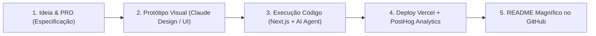

# 🚀 Plano de Transição de Carreira & Guia de Execução: Product Engineer (US Remote AI Startups)

> **Documento Norteador Estratégico**  
> *Autor:* Doni Silva (Doni Ramos)  
> *Objetivo:* Posicionamento como **Product Engineer (AI-Augmented Full-Stack)** para vagas remotas internacionais em dólar (faixa de US$ 7.500/mês ~ R$ 40.000+/mês).

---

## 📌 1. Visão Geral & Oportunidade de Mercado

### 💡 A Mudança de Paradigma no Mercado Global (2025/2026)
Startups norte-americanas early-stage de Inteligência Artificial e Dados não estão buscando desenvolvedores engessados que demoram 2 a 3 semanas para entregar uma tela simples. O mercado busca o **Product Engineer**:

- **Definição:** O desenvolvedor que une **visão de produto, alto senso de UI/UX, agilidade extrema com ferramentas de IA (Cursor, Antigravity, Claude)** e capacidade de entregar a aplicação completa — da ideia ao deploy na Vercel com analytics (PostHog), banco de dados (Postgres/Supabase) e cache (Redis).
- **Faixa Salarial Alvo:** US$ 7.500/mês a US$ 10.000/mês (Remoto Global).

### 🎯 Diagnóstico da Sua Bagagem Profissional (Doni Silva)
Você possui uma combinação rara e extremamente valiosa no mercado:

| Seu Histórico | O Valor para o Recrutador / CTO Gringo |
| :--- | :--- |
| **4 Anos no Banco Inter** | Rigor técnico de engenharia, arquitetura escalável, segurança e maturidade de código em uma grande fintech de milhões de usuários. |
| **Governo de Goiás (Sustentação Web)** | Domínio prático de ecossistemas Web (TypeScript, JavaScript, Angular) e manutenção de sistemas corporativos. |
| **Criação Autônoma de MVPs com IA** | Domínio do fluxo moderno de alta velocidade: Next.js, React, TailwindCSS, Supabase/Postgres, Redis, PostHog, Vercel e APIs de LLMs. |

---

## 👔 2. Posicionamento Profissional & Reestruturação do LinkedIn

### 🏷️ O Cargo Exato
- **Nome Principal:** `Product Engineer` ou `AI-Augmented Full-Stack Engineer`
- **Sub-especialidade:** `Frontend-Heavy Full-Stack`

### ✍️ Guia de Headline para o LinkedIn
Em vez de se intitular apenas *"iOS Developer"* ou *"Angular Developer"*, sua nova Headline deve transmitir sênioridade técnica + foco moderno:

> **Senior Product Engineer | React, Next.js, TypeScript, AI Applications & UI/UX | Ex-Banco Inter**

---

### 📖 Estrutura da Seção "Sobre" (About - Storytelling)
> *"Sou Engenheiro de Software Sênior com forte bagagem em aplicações escaláveis e visão de produto de ponta a ponta. Com histórico de 4 anos no Banco Inter atuando em arquitetura e código de alta performance, evoluí minha atuação para o ecossistema Web & IA como Product Engineer.*
> 
> *Minha especialidade é transformar ideias em produtos completos de alta conversão e estética impecável (UI/UX), utilizando Next.js, React, TypeScript, TailwindCSS, Supabase (Postgres), Redis (Upstash) e analytics avançado com PostHog.*
> 
> *Utilizo Inteligência Artificial de forma aumentada no fluxo de desenvolvimento para entregar MVPs robustos em velocidade recorde, mantendo papo técnico de arquitetura de alto nível com CTOs e times globais."*

---

### 🏢 Reestruturação da Experiência Profissional
- **Governo do Estado de Goiás (2025 - Presente):**
  - Foco nas competências: *Front-End Engineering, TypeScript, Web Systems, API Integration, Performance & UI Maintenance*.
- **Banco Inter (4 Anos):**
  - Foco nas competências: *Software Architecture, Code Quality, Mobile/Web Systems, High Scalability, Agile Methodologies, Enterprise Security*.

---

## 🏗️ 3. Os 3 Projetos de Portfólio de Elite (Blueprints Completos)

Estes 3 projetos serão o seu cartão de visitas público no GitHub. Cada um responde diretamente às exatas exigências das vagas em dólar de startups de IA.

---

### 📊 Projeto 1: "DataPulse AI" — Agente de Análise de Dados & BI Inteligente
> **Foco da Vaga Alvo:** *AI Tool voltada para Dados / Personal Data Scientist*.

- **Descrição do Produto:** Um dashboard de Business Intelligence onde o usuário envia um arquivo CSV/JSON (ou escolhe dados de demonstração) e faz perguntas em linguagem natural (*ex: "Qual foi nosso serviço mais rentável no trimestre e qual a tendência de churn?"*). A IA interpreta a base, gera os gráficos interativos em tempo real (Recharts) e fornece um relatório de insights estratégicos com explicação do código SQL gerado.
- **Diferencial Visual:** Modo escuro ultra moderno, gráficos animados, animações de loading do agente de IA e cards de métricas em tempo real.
- **Tech Stack:**
  - **Framework:** Next.js 15 (App Router, Server Components)
  - **Linguagem:** TypeScript
  - **Estilização:** TailwindCSS + Shadcn/UI + Lucide Icons
  - **Banco de Dados:** Supabase (PostgreSQL)
  - **Engine de IA:** Vercel AI SDK + OpenAI / Claude API (Structured Output / Function Calling)
  - **Visualização de Dados:** Recharts / Chart.js
  - **Analytics & Observabilidade:** PostHog
  - **Hospedagem:** Vercel

---

### ⚡ Projeto 2: "InsightFlow" — Analytics de Feedback & Sentimento de Clientes em Tempo Real
> **Foco da Vaga Alvo:** *Uso de Redis, Caching, PostHog e Arquitetura de Métricas*.

- **Descrição do Produto:** Uma plataforma SaaS que centraliza a ingestão de avaliações, feedbacks e mensagens de suporte ao cliente. A IA analisa o sentimento de cada mensagem em tempo real (Positivo, Neutro, Risco de Churn), categoriza por tópicos de dor e dispara alertas.
- **Diferencial Visual:** Dashboard analítico estilo Stripe/Linear, filtros avançados em tempo real, badges de sentimento e indicador de taxa de retenção.
- **Tech Stack:**
  - **Framework:** Next.js 15 + React
  - **Linguagem:** TypeScript
  - **Estilização:** TailwindCSS + Framer Motion
  - **Cache & Rate Limit:** Upstash Redis
  - **Banco de Dados:** Supabase (Postgres)
  - **IA & NLP:** OpenAI API (Sentiment Analysis & Keyword Tagging)
  - **Product Analytics:** PostHog Event Tracking
  - **Hospedagem:** Vercel

---

### 🎨 Projeto 3: "Nova Engine AI" — Gerador de Landing Pages e Copy de Alta Conversão
> **Foco da Vaga Alvo:** *Qzinho pra UI / Interfaces que não parecem geradas por IA*.

- **Descrição do Produto:** Um gerador interativo onde o usuário digita o conceito do seu produto/serviço e a IA constrói a estrutura da Landing Page com código React/Tailwind preview em tempo real, copy de alta conversão e exportação de componentes.
- **Diferencial Visual:** Interface estilo Canva/Figma com Split-View (Editor à esquerda, Preview ao vivo à direita), micro-interações elegantes.
- **Tech Stack:**
  - **Framework:** Next.js 15
  - **Linguagem:** TypeScript
  - **Estilização:** TailwindCSS + Framer Motion
  - **IA Engine:** Vercel AI SDK (Streaming Responses)
  - **Banco de Dados:** Supabase (Postgres)
  - **Hospedagem:** Vercel

---

## 🔄 4. O Fluxo de Trabalho (Ideia → Protótipo → Execução → Deploy)

Para cada um dos 3 projetos, o método de execução em novas conversas com a IA será:

### 📋 Estrutura Padrão do `README.md` dos Repositórios:
1. **Banner & GIF Demonstrativo:** Animação curta gravada do sistema funcionando.
2. **Badge da Tech Stack:** Next.js, TypeScript, Tailwind, Postgres, Redis, PostHog, Vercel.
3. **Link Live Demo:** URL pública na Vercel para o recrutador testar instantaneamente.
4. **Principais Recursos & Arquitetura:** Diagrama Mermaid da arquitetura do projeto.
5. **Instruções de Instalação Local:** `git clone`, `npm install`, `.env.example`, `npm run dev`.

---

## 🎯 5. Guia para Utilização deste Arquivo em Novas Sessões

Sempre que você abrir um novo projeto ou uma nova conversa comigo para avançar nesse plano:

1. **Copie e cole este documento** ou anexe-o na conversa.
2. **Defina a meta da sessão:** Ex: *"Hoje vamos construir o Projeto 1 (DataPulse AI) a partir do fluxo Ideia > Protótipo > Código"*.
3. **Execute em etapas:**
   - **Sessão A:** Especificação Técnica + Estrutura de Pastas do GitHub.
   - **Sessão B:** Desenvolvimento dos Componentes de UI/UX.
   - **Sessão C:** Integração da IA (Vercel AI SDK), Postgres e Redis.
   - **Sessão D:** Conexão com PostHog, Deploy na Vercel e README do GitHub.
   - **Sessão E:** Reestruturação Final do perfil do LinkedIn e estratégia de aplicação para vagas remotas em dólar.

---

*LashMenu Project Workspace · 2026*
